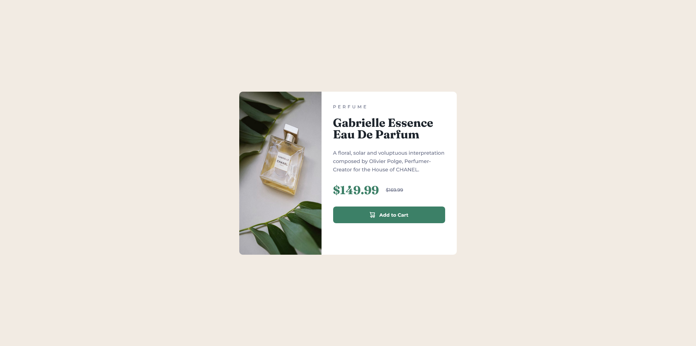

# Frontend Mentor - Product preview card component solution

This is a solution to the [Product preview card component challenge on Frontend Mentor](https://www.frontendmentor.io/challenges/product-preview-card-component-GO7UmttRfa). Frontend Mentor challenges help you improve your coding skills by building realistic projects. 

## Table of contents

- [Overview](#overview)
  - [The challenge](#the-challenge)
  - [Screenshot](#screenshot)
  - [Links](#links)
- [My process](#my-process)
  - [Built with](#built-with)
  - [What I learned](#what-i-learned)
  - [Continued development](#continued-development)
  - [Useful resources](#useful-resources)
- [Author](#author)

## Overview

  This project is build with HTML and Sass CSS preprocessor. This is the first time I used Sass and I was able to create reusable CSS variables and implement CSS selector nesting to target specific elements while making CSS code shorter.

### The challenge

Users should be able to:

- View the optimal layout depending on their device's screen size
- See hover and focus states for interactive elements
- Use one of the CSS preprocessors (Sass, Less, Stylus, etc)

### Screenshot

### Links

- Solution URL: [https://www.frontendmentor.io/solutions/product-preview-card-using-sass-css-preprocessor-and-media-queries-8cjuaYeni2](https://www.frontendmentor.io/solutions/product-preview-card-using-sass-css-preprocessor-and-media-queries-8cjuaYeni2)
- Live Site URL: [https://schindlerdumagat.github.io/product-preview-card-component/](https://schindlerdumagat.github.io/product-preview-card-component/)

## My process

To use Sass, I first read its documentation and learned the basics. Afterwards, I proceeded to build the project.

### Built with

- Semantic HTML5 markup
- CSS custom properties
- Flexbox
- Mobile-first workflow
- [Sass](https://sass-lang.com/) - CSS preprocessor

### What I learned

In this project, I learned how to use Sass. I was able to apply CSS selector nesting to target specific elements in my HTML and create variables to setup my project theme and use it throughout my project.

### Continued development

To improve this project, I will dig deeper in Sass and then refactor my input.scss file to follow the best practices and apply other Sass techniques if possible.

### Useful resources

- [Sass](https://sass-lang.com/) - This helped me understand Sass and apply it in this project

## Author

- Website - [Schindler C. Dumagat](https://schindlerdumagat.github.io/webportfolio/)
- Frontend Mentor - [@schindlerdumagat](https://www.frontendmentor.io/solutions/product-preview-card-using-sass-css-preprocessor-and-media-queries-8cjuaYeni2)
- LinkedIn - [schindler-dumagat](https://www.linkedin.com/in/schindler-dumagat-015238230/)
